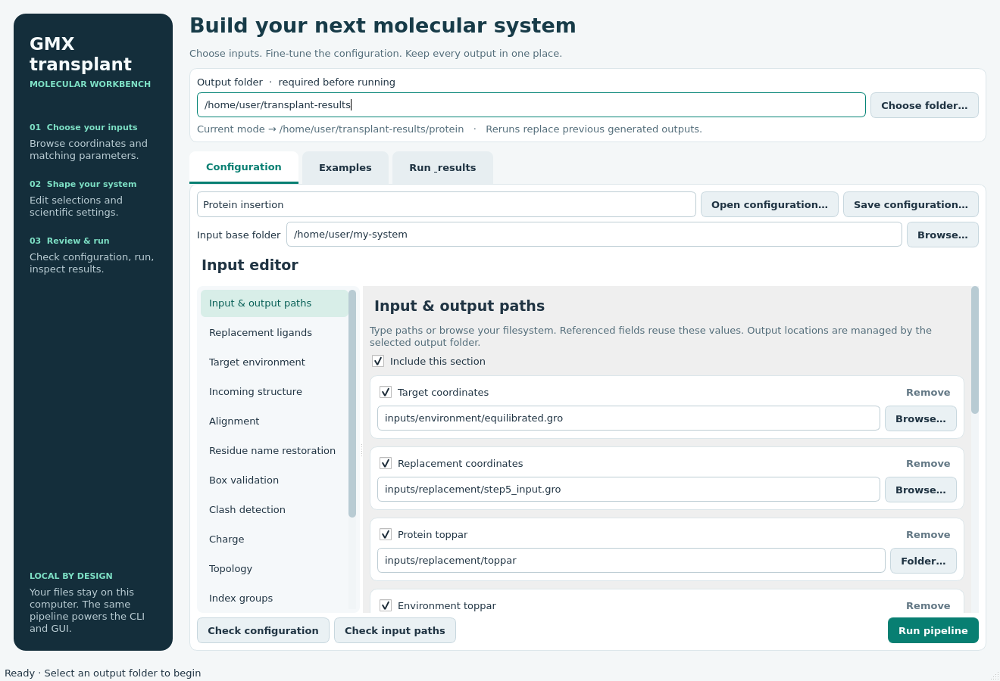
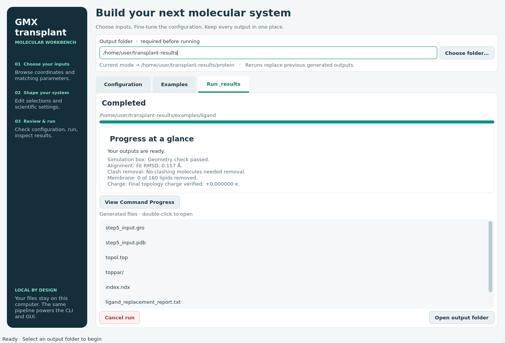
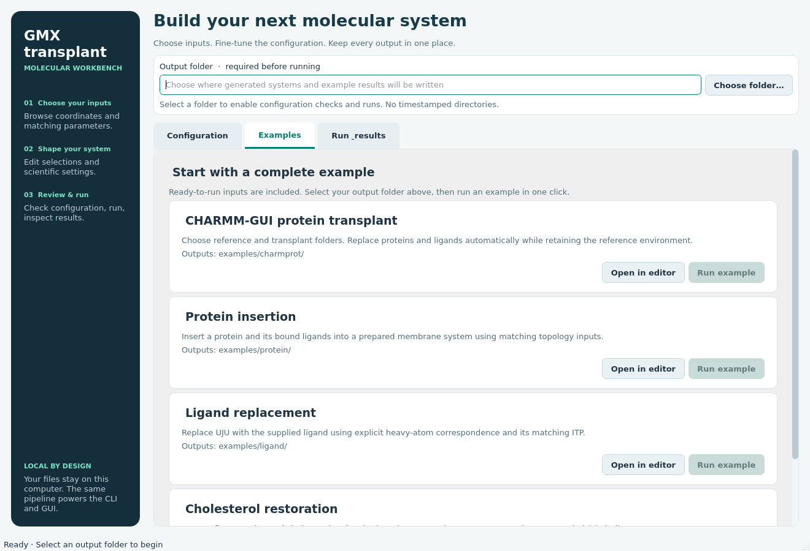

# Desktop application

The desktop application is the main way to use GMXtransplant. It edits the same
configurations and runs the same pipeline as the command-line tool, so anything
set up here can also be run with `gmxtransplant` in scripts or on a cluster. It
runs locally on macOS, Linux, or inside WSL 2 with WSLg. It does not upload input
files or run a web server.



## Install and launch

From the source directory containing `pyproject.toml`:

```bash
python -m pip install .
gmxtransplant-gui
```

This one installation provides both the desktop application and the
`gmxtransplant` command-line tool. For editable development, use
`python -m pip install -e .`. From a wheel, use
`python -m pip install /path/to/gmxtransplant-0.1.0-py3-none-any.whl`.
The equivalent module launch is `python -m gmxtransplant.gui`.
Activate the same Python environment you used for installation before launching.

Qt (PySide6) is installed with the package but only loaded when the application
is launched, so the command-line tool also runs on machines without a display.
Where PySide6 cannot be installed, `GMXTRANSPLANT_CLI_ONLY=1 python -m pip install .`
installs the command-line tool alone; add the application later with
`python -m pip install "PySide6>=6.6,<7"`. The complete molecular example datasets ship
with the package so installed examples also work offline. Example data adds
approximately 58 MB on disk; the complete wheel is about 12 MB compressed.

On Linux, launch from a graphical desktop session. On Windows, install and launch
inside WSL 2 with WSLg, using the Linux Python environment. Windows 10 build
19044+ or Windows 11 is required for Microsoft's integrated Linux GUI support.
See [Microsoft's WSL GUI setup](https://learn.microsoft.com/en-us/windows/wsl/tutorials/gui-apps).
The chooser can browse Linux paths and mounted Windows drives such as `/mnt/c/`
and `/mnt/f/`. Use Linux paths inside WSL, rather than `C:\...` or `F:\...`.
A headless SSH session needs display forwarding; the CLI remains usable without
a display. Linux distributions may require the system libraries used by Qt's
X11/Wayland platform plugin in addition to the Python installation.

## Your first run

1. Check the **Output folder** at the top. It starts as the folder you launched
   `gmxtransplant-gui` from, just as the command-line tool writes to the folder
   it runs in; choose another with **Choose folder…**. Checking or running
   without one shows a message at the top of the window explaining what is
   missing.
2. Choose a mode: CHARMM-GUI protein transplant (first), protein, ligand, cholesterol, add binder outside the membrane protein, or standalone minimization preparation.
3. Start from the mode's template, or open a complete example from the Examples
   tab with **Open in editor**. Placeholder inputs must be replaced with your own files.
4. Use the **Input editor** to choose every input. Each field holds one
   complete path: browse for it, or type it in full. There is no input base
   folder, and nothing is resolved against a shared root or the working
   directory, so an incomplete path is reported before the run starts, naming
   the field. Expand configuration sections to edit selections, alignment,
   topology, composition, and other settings.
5. Use **Check configuration** for schema/values, then **Check input paths** for
   the existing loader's input checks. Neither performs full assembly validation.
6. Click **Run pipeline**. The Run & results tab shows a **Progress at a glance**
   box with the current stage, key results (such as alignment and charge), and
   scientific warnings or errors. Detailed output is collapsed on every new run;
   click **View Command Progress** to expand it and **Hide Command Progress** to
   collapse it. The log keeps collecting while hidden. When the run ends, the
   absolute folder the outputs were written to is printed above the file list
   and in the log; double-click any generated file to open it.

The form exposes current settings even when omitted by a template. Every setting
has a one-line explanation under it saying what it does and what you can change.
Deprecated settings are not shown. Each setting has exactly one control:

- Settings with a default are shown pre-filled. They are written to the YAML only
  when they were in the loaded file or you change them.
- Settings the pipeline detects or infers (such as protein molecule names or box
  dimensions) have one checkbox. Unticked, the pipeline decides; ticked, the
  field for your value appears.
- Sections the pipeline switches on and off (topology, residue name
  restoration, minimization) have one checkbox for the whole section. The
  `index.ndx` index file is always written, so it has no switch.
- On/off settings are a single checkbox; numbers, dropdowns for supported
  methods, and file/folder choosers are used elsewhere.
- Lists of names or numbers are one text field, for example `PROA, PROB`.
  Named entries (residue tables, environment overrides) have an inline name
  field and **Add** button, which appear once the setting is ticked.
- Output folders are not shown: every output follows the output folder chosen at
  the top of the window.

Residue labels retain uppercase names such as CHL, POP, and TIP. Only settings
accepting genuinely different values offer a choice, such as reading a ligand's
charge from its ITP or entering a numeric charge.

The minimization section shows only the restraint strength, iteration limit,
OpenMM platform, and custom residue classes; everything else uses defaults.
Protein and ligand heavy atoms and lipid head groups are restrained, while lipid
tails, water and ions relax.

Use **Theme** in the top-right corner to switch between the Teal, Midnight (dark)
and Sand colour themes. The choice applies to every window, including file
choosers, and is remembered.

Messages and errors appear in a banner inside the window rather than in pop-up
dialogs, and file choosers never block the main window. Under WSLg a modal
pop-up can open behind the main window, which previously made the application
look frozen.

There is no YAML editing in the application: the form builds the configuration
in the background. Each run saves it as `run.yaml` in the output folder, with every
input as a complete path, so the same setup can be repeated from the command line
with `gmxtransplant --mode <mode> -i run.yaml`. Existing YAML files are run with the
command-line tool. Switching modes retains each mode's edits.



## Documentation

**Documentation** in the left panel opens the complete PDF documentation that
ships with the package. It is resolved relative to the installed package, never
to a location on your computer. The button tries your desktop's default PDF
viewer first (the Windows default viewer under WSL), falls back to your default
web browser, and reports a clear error if neither is available. The viewer opens
in the background; the GUI never waits for it.

## macOS and MacBook Air

Use a graphical macOS desktop session and a native Python 3.10+ installation
matching your machine (arm64 on Apple Silicon, x86_64 on Intel). macOS 13+ is the
recommended baseline for current Qt releases; check the
[Qt platform requirements](https://doc.qt.io/qt-6/supported-platforms.html)
for the particular PySide6 version installed. Qt supplies native macOS wheels;
XQuartz and Linux DISPLAY/WAYLAND_DISPLAY variables are not needed.
See [Qt for Python installation](https://doc.qt.io/qtforpython-6.8/gettingstarted.html).

From the repository root, these commands work in Bash and zsh:

```bash
python3 -m venv .venv
source .venv/bin/activate
python -m pip install --upgrade pip
python -m pip install .
gmxtransplant-gui
# Equivalent launch:
python -m gmxtransplant.gui
```

For an existing installation, activate its environment and run
`python -m pip install --upgrade .` from the repository root. Close and
reopen the application after upgrading.

The cholesterol example needs Open Babel. On macOS 14 or newer it is installed
together with GMXtransplant. On macOS 12 and 13 install it with Homebrew,
`brew install open-babel`, then verify `obabel -V` in the same terminal used to
launch the GUI. See the [Homebrew Open Babel formula](https://formulae.brew.sh/formula/open-babel).
The protein and ligand examples do not require Open Babel. PyMOL remains optional
for its specific alignment methods; the examples use the NumPy-based mask fit.

A macOS GUI test job is included in CI alongside Linux. Local verification for
this release used Linux with Qt's offscreen display, not a physical Mac.

## Output layout and replacement

```text
selected_output_folder/
├── protein/
├── ligand/
├── cholesterol/
├── minimization/
│   └── openmm_minimization/
└── examples/
    ├── protein/
    ├── ligand/
    └── cholesterol/
```

Folders are created only when used. There are no timestamps or nested run
folders. Coordinates, `topol.top`, `toppar/`, index files, reports, and enabled
diagnostics go directly into the applicable mode directory. The GUI uses the
configured output filenames, but redirects output directories to this layout.
A portable minimization bundle requires its own `openmm_minimization/` directory.

Every run writes `run.yaml` (the exact configuration with resolved absolute input
paths), `run.log`, and `run-status.json` beside the products. The snapshot can be
run through the CLI. Source input files stay in their original locations. Shared
`${name}` references stay intact in the editor and are resolved in the run snapshot.

**Repeating a run replaces previous generated products automatically.** This
includes the generated `toppar/` and minimization bundle, so stale ITP files do not
survive. No overwrite confirmation is required. Output paths overlapping source
inputs and symlinked generated destinations are rejected. Unrelated files in the
output folder are retained. A hidden manifest tracks earlier generated filenames;
a lock prevents two GUI runs from writing to the same mode folder simultaneously.

Configuration/input validation runs before replacement, preserving previous
outputs when these checks fail. Once a full run starts, previous products are
removed and a failed/cancelled run may leave partial new products. Inspect the
run status and log; file existence alone does not indicate success. Avoid editing
inputs or running another application against the same outputs during a run.

## Examples



The **Examples** tab contains CHARMM-GUI transplant, protein, ligand, and cholesterol cards. After
selecting an output folder, **Run example** uses the complete supplied inputs in
one click and writes to `examples/charmprot/`, `examples/protein/`, `examples/ligand/`,
`examples/cholesterol/`, or `examples/addbinder/`. Reruns replace the same products. The GUI's mode editor
is not changed by running an example.

**Open in editor** loads the example for customization. A subsequent editor run
uses the normal mode directory (for example `cholesterol/`). Example inputs in
the installation remain unchanged.

The cholesterol example requires Open Babel, which is installed with the package
on Linux and macOS 14+ (see the README otherwise). Other optional
scientific dependencies are exactly those required by the CLI settings: PyMOL
for its alignment methods and OpenMM for running an exported minimization.
Minimization preparation itself does not launch a simulation.

## Cancellation and testing

**Cancel run** interrupts the worker and its external tools. A worker that does
not stop is killed after five seconds. Closing the window while running also
cancels the job. The GUI remains responsive because scientific work executes in
a separate process using the same Python environment.

Developers can run the focused tests without a display:

```bash
QT_QPA_PLATFORM=offscreen python -B -m unittest -v test_gui
```

Qt-dependent tests skip automatically if PySide6 cannot be imported. Model/path tests still run.

## Two-folder transplant and comparison views

The first mode requires only Reference and Transplant folders. Each must contain `topol.top`, `toppar/`, and `step5_input.gro` (or a unique `step5*.gro`). Optional selections and numerical settings are under **Advanced settings**. The default replaces all reference proteins and ligands with their transplant counterparts. Outputs go directly to `charmprot/`, or `examples/charmprot/` for its supplied example.

Output folders are not shown in the form: every output follows the output folder at the top of the window. The input-file list has no Add or Remove buttons; it edits the named paths the configuration actually uses. Named entries such as residue mappings keep an inline Add control.

**Open in PyMOL** and **Open in VMD** are shown only when that viewer is installed, and become available after a successful run. A viewer is found on the PATH, in the Python environment GMXtransplant runs in, or on macOS as an application in `/Applications` or `~/Applications` (for example `PyMOL.app` or `VMD 1.9.4….app`). To use a copy installed elsewhere, set `GMXTRANSPLANT_PYMOL` or `GMXTRANSPLANT_VMD` to its full path before launching. Each opens the generated comparison scene. The coordinate pipeline does not require either viewer. See [the visualization guide](VISUALIZATION.md) for the color legend and aligned input overlays.
