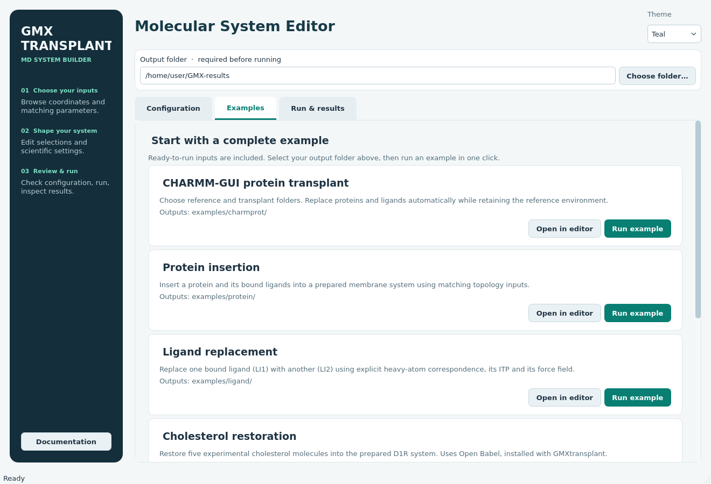
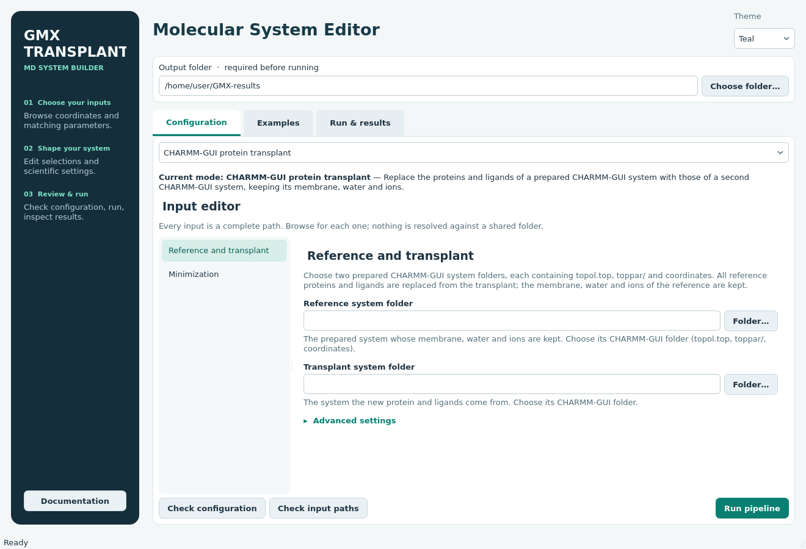

# GMXtransplant desktop guide

GMXtransplant helps you build a new molecular system from prepared structures.
You choose the inputs, check the setup, run the calculation, and inspect the
results in one desktop window. Your input files stay on your computer.

## Open the application

If GMXtransplant is already installed, open a terminal and run:

```bash
gmxtransplant-gui
```

To install on Linux or WSL 2 with WSLg, first clone the source:

```bash
git clone https://github.com/MidhunkMadhu/GMXtransplant.git
cd GMXtransplant
```

Choose **one** of these options; run only one block.

**Option 1: Python `venv`**

```bash
python3 -m venv .venv
source .venv/bin/activate
python -m pip install .
gmxtransplant-gui
```

**Option 2: Conda**

```bash
conda create -n gmxtransplant python=3.12 pip
conda activate gmxtransplant
python -m pip install .
gmxtransplant-gui
```

If you already have a suitable Python environment, activate it and run
`python -m pip install .` from the cloned folder. On macOS, use the same
commands in Terminal.

The next time you open a terminal, activate the environment you chose, then
run `gmxtransplant-gui`. On Linux, use a graphical desktop session. On Windows,
use WSL 2 with WSLg. On macOS, open the application from a graphical desktop
session. See [platform help](#platform-help) if the window does not open.

## Try an included example

The examples include the input structures and settings they need. They are a
good way to learn what a completed run looks like.

1. At the top of the window, click **Choose folder…** and select a folder for
   results. The box initially shows the folder from which you launched the
   application; check it before running.
2. Open the **Examples** tab. Choose an example card and click **Run example**.
   The add binder cards demonstrate a ligand above a receptor and a G protein
   below it. Other cards cover protein transplant, protein insertion, ligand
   replacement, and cholesterol restoration.
3. Follow the run in **Run & results**. **Progress at a glance** shows the
   current step and key findings. Click **View Command Progress** for the full
   log if you want more detail.
4. When the run finishes, the result folder appears above the file list.
   Double-click a report to open it. If PyMOL or VMD is installed, use its
   button to open the generated view.



To use an example as a starting point for your own system, click **Open in
editor**. The form will open with its settings filled in. An example run saves
to an `examples/` folder; a run started from the editor saves to the selected
mode's folder.

## Set up your own system

Open the **Configuration** tab and choose the task that matches your goal:

| Task | What it does | Main inputs |
| --- | --- | --- |
| CHARMM-GUI protein transplant | Keeps the membrane, water, and ions from one prepared system, then replaces its protein and ligands with those from another. | Reference and transplant system folders |
| Protein insertion | Replaces a protein in a prepared system with a new protein and any bound ligands. | Target and replacement structures with matching topology files |
| Ligand replacement | Replaces one bound ligand while keeping the rest of the system. | Prepared system, incoming ligand structure, GROMACS ITP parameter file, and force field |
| Cholesterol restoration | Places experimentally resolved cholesterol into a prepared system. | Target system and experimental structure |
| Add binder | Places a ligand or protein above or below a membrane protein, with a separate system for each pose. | Prepared host system, binder coordinates, and binder parameters |
| Minimization preparation | Creates a folder of inputs for a restrained OpenMM minimization. | Assembled coordinates and topology |

For add binder inputs and placement options, see the [addbinder guide](ADDBINDER.md).
The [included examples](../../examples/addbinder/README.md) show a ligand above a
receptor and a G protein below it.

Fill in the visible input fields first. Click **Browse…** or **Folder…** to
select each file or folder. If you type a path, enter its full location. Open
**Advanced settings** when you need to change selections, geometry, topology,
composition, or other scientific settings. Help text appears beside each
setting. You can switch between tasks without losing the edits you made to
each task during this session.



Before starting a full run:

1. Click **Check configuration** to find missing or invalid settings.
2. Click **Check input paths** to check that the named input files and folders
   can be used.
3. Click **Run pipeline**. The full run also checks the assembled system and
   reports problems it finds. The two earlier checks do not build a system.

If a check fails, read the message at the top of the window. The **Run &
results** tab has more detail under **View Command Progress**. Correct the
named field and run the check again.

## Find and review your results

GMXtransplant creates a subfolder inside the output folder you selected. Each
task has its own subfolder, such as `protein/`, `ligand/`, `cholesterol/`,
`addbinder/`, or `charmprot/`. Included examples go under `examples/`. An add
binder run also creates one folder per pose.

Look for the report and the final coordinate and topology files in that
subfolder. `run.log` contains the detailed messages. `run-status.json` records
whether the run completed, failed, or was cancelled. `run.yaml` saves the
settings and input locations used for that run, so you can keep a record of
how the system was built.

**Running the same task again in the same output folder replaces files from
the previous GUI run.** Choose a different output folder if you want to keep
both sets of results. Your source inputs are left in place. If an existing
file has a name GMXtransplant needs but was not made by an earlier GUI run,
the application stops before replacing it. Move that file or choose another
output folder.

Click **Cancel run** to stop a run. A failed or cancelled run may leave partial
results in its folder; check the status and log before using those files.

PyMOL and VMD are optional. Their buttons appear only when the application
finds them. See the [visualization guide](VISUALIZATION.md) for the scene
colors and the structures shown together.

## Common questions

**Why does an input path fail?** Use **Browse…** or **Folder…** to select the
actual input. A typed path must include its full location. Choosing an output
folder does not set a base folder for inputs.

**Why is a setting missing from the form?** Look in **Advanced settings** on
the relevant page. Some settings become visible after you turn on their
section.

**Where did the output go?** Open **Run & results**. The full result folder is
shown above the file list after a run. It is also named at the end of the log.

**Why does the cholesterol example mention Open Babel?** That workflow needs
Open Babel to prepare cholesterol coordinates. If the application reports it
missing, install Open Babel and restart GMXtransplant.

**Where is the full manual?** Click **Documentation** in the left panel to
open the manual included with the application.

You can change the appearance with **Theme** at the top right. Your choice is
remembered the next time you open the application.

## Platform help

On **Linux**, launch the application from a graphical desktop session. If you
are connected to a remote computer without a desktop, use the command-line
tool described in the [README](../../README.md).

On **Windows**, use WSL 2 with WSLg and install GMXtransplant inside the Linux
environment. Browse using Linux paths, including `/mnt/c/` for the Windows C:
drive. If the application window does not appear, check that graphical Linux
applications work in your WSL installation.

On **macOS**, install in a Python environment that matches your Mac. The
cholesterol workflow also needs Open Babel. Install it separately if
GMXtransplant reports that it is missing.
